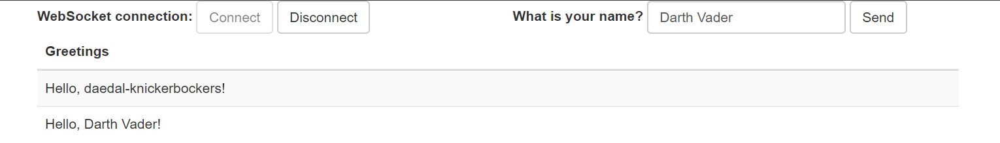

# Using WebSocket to build an interactive web application

[LINK](https://spring.io/guides/gs/messaging-stomp-websocket/) to the tutorial

## Steps taken

Learn about [STOMP](https://en.wikipedia.org/wiki/Streaming_Text_Oriented_Messaging_Protocol). Haven't heard about this yet but sounds great 🙂

Create small maven build script and add dependencies. Create a small class `HelloMessage` that will represent a string model in the application. Wrote a small test class to get into that test driven development mood 😉 Letting `mvn test` run shows some promising results!

```
[INFO] -------------------------------------------------------
[INFO]  T E S T S
[INFO] -------------------------------------------------------
[INFO] Running hello.HelloMessageTest
[INFO] Tests run: 3, Failures: 0, Errors: 0, Skipped: 0, Time elapsed: 0.062 s - in hello.HelloMessageTest
[INFO]
[INFO] Results:
[INFO]
[INFO] Tests run: 3, Failures: 0, Errors: 0, Skipped: 0
[INFO]
[INFO] ------------------------------------------------------------------------
[INFO] BUILD SUCCESS
[INFO] ------------------------------------------------------------------------
[INFO] Total time:  5.810 s
[INFO] Finished at: 2019-06-06T19:45:55+02:00
[INFO] ------------------------------------------------------------------------
```

Write another small model `Greeting` and this time, implement the test class `GreetingTest` first. Really try to hold true to that "*write test, fail test, implement*" style of coding. It works 😁 Also beef up the test cases to cover the parsability of classes with jackson because I had problems with that in the second tutorial. Seems to work fine after some fiddling.

```
[INFO] -------------------------------------------------------
[INFO]  T E S T S
[INFO] -------------------------------------------------------
[INFO] Running hello.GreetingTest
[INFO] Tests run: 3, Failures: 0, Errors: 0, Skipped: 0, Time elapsed: 0.298 s - in hello.GreetingTest
[INFO] Running hello.HelloMessageTest
[INFO] Tests run: 5, Failures: 0, Errors: 0, Skipped: 0, Time elapsed: 0.006 s - in hello.HelloMessageTest
[INFO]
[INFO] Results:
[INFO]
[INFO] Tests run: 8, Failures: 0, Errors: 0, Skipped: 0
[INFO]
[INFO] ------------------------------------------------------------------------
[INFO] BUILD SUCCESS
[INFO] ------------------------------------------------------------------------
[INFO] Total time:  3.662 s
[INFO] Finished at: 2019-06-06T20:23:05+02:00
[INFO] ------------------------------------------------------------------------
```

I'm actively trying to keep tests descriptive, so I use the "*ShouldDoThisIfThat*" format of naming my test case functions. I'm also keeping the asserts as descriptive as possible, surrounding some of them with `is( ... )` to make the assert an easy read. This makes it easy on the eyes (and hopefully also the brains 😉) but adds another import and another layer of nested functions. Not sure if I will keep this in future test cases.

```java
@Test
public void shouldNotHaveNameWhenEmpty() {
    HelloMessage cut = new HelloMessage();
    assertThat(cut.name(), is(nullValue()));
}
```

This took long enough... Back to the actual tutorial! 😉 Create `GreetingController` that will handle web socket requests to certain paths and sends messages into specific *topics*. While searching for a *quick* way to also write a test class for the controller I learn that testing the web layer is a bit more work than anticipated. However, there is a whole tutorial available for this. This will be the next one I work on. For now, on with the web socket tutorial.

Create a simple configuration to enable the use of web sockets. This configuration creates a *root path* that all messages need to be sent to. Every controller is then a node further down that path. Also enable the sending of messages back from the server to a certain topic and fallbacks if the reference web sockets are not available.

Now on to the client side of things. Create a very simple `index.html` that displays a login button, an input field for the user's name and a table that will show all the content of the *greetings* topic. Create simple `app.js` file that handles user input, connecting the web socket to the backend and listening to new greetings.

Create a small `Application` class to bootstrap everything together in one .jar file and run `mvn spring-boot:run` to test it all out.



This looks good to me 😎

**End of Tutorial**