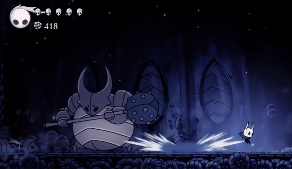
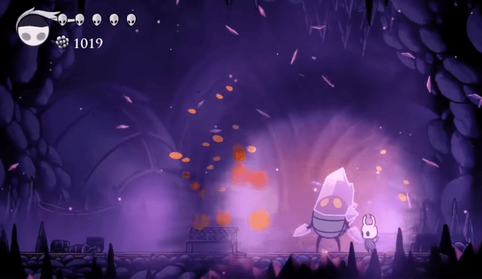
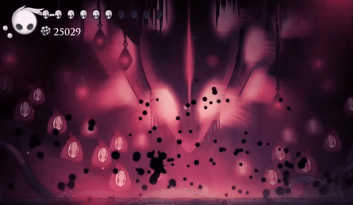
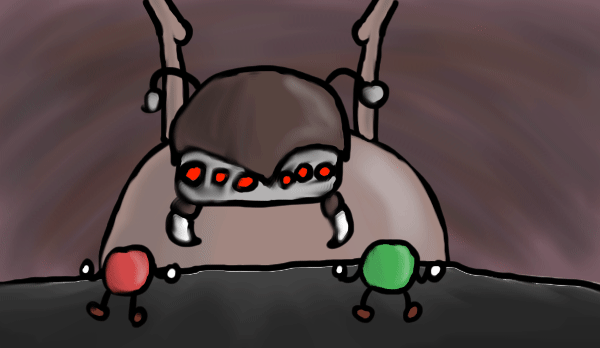

# WIP: BEAT THE BUG
A fun little coding exercise that should become a small and enjoyable little game.

## What is the game?
In "Beat the Bug", a group of players try to stand their ground against one giant bug that throws different challenges at them. Every challenge that gets mastered by the players will reduce the bugs strength. However, every player will only be able to loose one challenge and has then to start again from scratch. Those players that beat a challenge however will become stronger, being able to inflict more damage to the bug in the following rounds.

The game itself will be a small web application connected to a backend server and database where player data is handled. Players will be able to see other players and need to work together to beat the bug.

## What is the exercise?
I want to give myself a fun and rewarding challenge in learning and enforcing new technologies, skills and methods I haven't used in a long time or didn't use before at all. Most of all, "Beat the Bug" will be my recurring exercise for the following technologies and clean code techniques.

### Java
The last time I touched Java for something serious has been in university while working part time at my first real developer job. Java 8 was just a new thing out there and nobody really knew how to use all that fancy stuff like lambda expressions or consumers. To this day, I haven't really written anything with Java 8 in mind, let alone Java 12 that has been released earlier that year. I just skimmed through some of the new features. Modules? Optionals? Type Inference? This sure looks really exciting to try out!

### Spring Framework
Most of the time, I don't want to reinvent the wheel and get over with the "boring" stuff that comes with developing and get right into the "fun" stuff. Boring stuff includes writing excessive lines of code or annotation to map application data to a database interface, or writing even more lines of code to just define REST services for your data. It seems that I can now just minimize this time spent and use the Spring framework! Just skimming over the possible features makes me smile 

### Angular
We're up to what version of Angular now? Angular 9? I also missed five version of updates here... My saving grace might be that I already worked intensely with Angular 4, so the new app structure and using Typescript are not unfamiliar to me. The new features also look very cool. Template views generating code? I'll definitely try that! Animation will also play a big part in the game, so good news that *"though Angular's intuitive API"* it should now be very easy to create those.

## Top Down View of the Game
Someone a lot smarter than me once said at a conference something like this:

| You always create your application top down, except the first time.

At that time, this hit a little too close to home. So this *first time*, I'll try to prove that person wrong, failing eventually 😉 but hey, isn't failing the thing that makes trying interesting? So I took a few notes about the ideas I want to incorporate in *Beat the Bug* and have drawn out a small handful of screens that will be at the top most position of the project - **the frontend**.

### The Frontend
The frontend will be split up in four main parts.


#### The Homescreen
This is the first screen that new players should see. They will be greeted by the games title and can then decide to play a round. When hitting the *Play* button, they will be transferred to the lobby.

#### The Lobby
To not throw a unlimited number of players into one game, the players will be split up into different game lobbies, each representing a single instance of a game. In a lobby, a player can pick his or her player name and the color they want to be displayed in the game. Other players that are already waiting in the lobby will also be displayed. Once all players in a lobby have clicked on the *Ready* button, the game will begin, sending them to the challenge.

#### The Challenge
The challenge is where the players will face off against the bug in a series of escalating challenges. The bug will be displayed prominently as the common obstacle for all players, it's massive healthbar at the top giving the player's a sense of their progress. On the top left, some information about the current challenge will be displayed. On the top right, messages concerning the game will be displayed to all players. At the bottom, the players will be visible. If either the bug is beaten or all players are defeated, all players will be transferred to the scoreboard.

#### The Scoreboard
On the scoreboard, the player's will be able to see their final results of the challenge. If they are up to a new challenge, they can click the *Back* button and land again on the homescreen.

### The Objects
By looking at the different screens of the mockup we can deduce our first batch of *"real world"* objects that we will need and what attributes might be necessary. After a lot of thinking and rewriting I currently only see two *real* objects that we need to keep an eye on.


#### The Game
A `Game` object will represent one instance of the actual Beat the Bug game. A `Game` therefore needs to be identifiable by a unique id to be separable from other `Game` instances. Furthermore, a `Game`can have different `GameState`s to identify if we are currently waiting for all players in the lobby to get ready, if the challenge is running or if it has ended.

We can skip creating specialized classes that hold information for the lobby or the scoreboard by simply using relevant `GameState`s for the different screens the `Game` can be on.

Using a separate `Bug` class can also be omitted. The `Bug`'s only *real* information would (at least for now) be its health, which we can be easily incorporated into the `Game` as well. Being the quantitative measurement of success of the players, it also fits rather nicely into the class.

As the players wil be facing different challenges that should get harder and harder, it makes sense to group them into different *levels*. As I want to keep these different challenges really simple for now, I will just add a level counter to the game that will represent the number of levels beaten by the players.

#### The Player
A `Player` will be a human participant in the game itself. One player can only ever be part of one `Game`, but one `Game` can hold multiple `Player`s. To distinguish the different participants, the users should be able to choose a *name* and a *color* for their `Player`. 

To keep track of the `Player`'s ready-state in the lobby, each player will hold that information as a separate attribute. The same goes for the fact if the `Player` is still alive and well or already beaten by the bug. A player may also decide to leave the game, either early after defeat or at the end after looking at the scoreboard. To be able to distinguish present and absent `Player`s, they will also hold that information.

### The Challenges
So for the players to overcome the bug, there needs to be some real challenge to it. To keep those encounters quick and easy to code and be able to use a lot of variety, I will keep them very simple, too. For inspiration, let's look at some boss encounters in other games to get some inspiration of what you might expect in *Beat the Bug*.

Every *Challenge* will be a set of fixed moves the bug can make, similar to a simple 2D boss fight. Here are some examples from the game [Hollow Knight](https://hollowknight.com/). As Hollow Knight is definitely a game worth playing for yourself, please look at these examples with caution - they might spoil some things for you. All short scenes shown here are taken from [RUSTY - The Superforge](https://www.youtube.com/channel/UCL-Tm21Rft-u6EI18n0EN2w)'s channel, from the video [Hey, Let's Rank all the Hollow Knight Bosses Again](https://www.youtube.com/watch?v=TASsX99Asew).

<details>
    <summary>What about rocks falling from above that the players need to evade?</summary>
    
</details>

<details>
    <summary>Or deadly lasers shooting from every direction?</summary>
    
</details>

<details>
    <summary>Or sharp spikes rupturing up from the ground?</summary>
    
</details>

<details>
    <summary>Or any combination of those?</summary>
    
</details>

To enable different combinations of the moves the bug can make, every challenge will be written down as some *sheet music* that will be played back by the game to let the players hear the sweet sound of their own demise 😉 Just kidding, we will keep everything around here kid friendly. The game will have a basic set of *moves* implemented and the *challenge* will just trigger the moves in succession, leaving defined pauses between them. A simple challenge might look something like this:

```json
{
    "_metadata": {
        "name": "swing_swing_slam",
        "health_from": 1.0,
        "health_to": 0.5,
        "max_speed": 1.25
    },
    "moves": [
        {
            "start_at": 0,
            "duration": 0.25,
            "move": "swing_to_right",
        }, {
            "start_at": 0.25,
            "duration": 0.25,
            "move": "swing_to_left"
        }, {
            "start_at": 0.75,
            "duration": 0.25,
            "move": "slam_middle"
        }
    ]
}
```

This will translate to the following challenge in the game:



Besides showcasing how a *sheet* gets translated to a *challenge*, this is also the first glimpse at what the artistic quality of the game might be. It won't be impressive 🙈

The time range of a move will go from 0.0 to 1.0. Every move will have a start time and a duration, making chaining and also parallel moves possible. Pauses are implemented by time frames that don't contain any moves.

As far as the metadata goes, the *health_from* and *health_to* attributes will determine in which lifecycle the bug will chose this challenge. This way, we can implement harder challenges the lower the bug's health gets. Also, by adding a speed multiplier, we can speed things up on harder difficulty. The added speed will be interpolated from 1.0 to *max_speed* between *health_from* and *health_to*, meaning lower health equals faster moves.